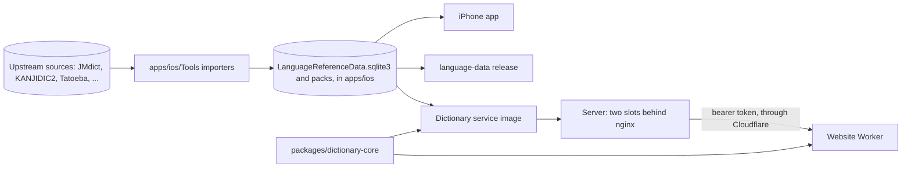

# Architecture

A map of the repository's parts, how data moves between them, and the rules that keep each part's
layers apart. Each part's own doc has the detail; each rule here is enforced by a check.

## Parts

| Part | What it is | Its doc |
| --- | --- | --- |
| `apps/ios` | The iPhone app, in Swift. It reads the language data bundled with it, which its importers in `apps/ios/Tools` build. | [`docs/agents/ios.md`](docs/agents/ios.md) |
| `apps/web` | zenbujapanese.com: Next.js on Cloudflare Workers through OpenNext. Its dictionary pages read the dictionary service. | [`docs/agents/web.md`](docs/agents/web.md) |
| `apps/dictionary-api` | The dictionary service: Node, in a Docker image on serpcompany's server, answering the website's dictionary requests by running the shared core on the app's language data. | [`docs/agents/dictionary-api.md`](docs/agents/dictionary-api.md) |
| `packages/dictionary-core` | The shared TypeScript core: search, results, word and kanji detail, and examples, ported from the app's Swift. Every client is to run it (ADR 0008). | [`docs/agents/dictionary-core.md`](docs/agents/dictionary-core.md) |
| `language-data` | The language-data release: the manifest and the pipeline that packages and publishes the app's data as a versioned artifact (ADR 0006). | [`language-data/README.md`](language-data/README.md) |
| `tools/checks` | The repository-wide checks behind `pnpm verify`. | [`docs/agents/code.md`](docs/agents/code.md) |

## How data moves

The app's bundled data is the one source: the importers build it, the app bundles it, the service's
image copies it, and the release packages it. The website reads no data of its own; it asks the
service, which runs the same core the website renders with. A new build of the data is a new
service image, deployed without touching the site.

The service's answers are a contract, typed and numbered in the core (`DictionaryContract`,
`dictionaryContract`). The site and the service deploy separately, in either order, so the site
compares the service's number with its own and logs a mismatch rather than refusing it; a test
fails a shape change that doesn't raise the number
([`docs/agents/dictionary-core.md`](docs/agents/dictionary-core.md), Rules).

The app and the website also meet at links: on an iPhone with the app, a dictionary URL opens in
the app (universal links). The app reads the website's URLs (`WebsiteLink.swift`), and the
website's association file names the app's bundle ID (`apps/web/src/lib/app-links.ts`). No check
ties the two: word URLs are permanent (ADR 0007), and the bundle ID changes only with the app's
App Store record (#616), when the file changes with it
([`docs/agents/web.md`](docs/agents/web.md), Links that open the app).

## Layers

Imports point one way inside each part, and a lint rule rejects the other direction with a message
saying where the code belongs:

- **The core** imports no runtime or framework: a client passes in its database, files, and
  capabilities ([`packages/dictionary-core/biome.json`](packages/dictionary-core/biome.json)).
- **The service**: readers and shared modules, then the worker layer, then HTTP, which reaches the
  dictionary only through the `DictionaryService` interface
  ([`docs/agents/dictionary-api.md`](docs/agents/dictionary-api.md), Code layout).
- **The website**: `src/lib`, then components and hooks, then routes; only
  `src/lib/dictionary/data.ts` reads the service's client, apart from `retired.ts`, which
  `worker.ts` runs before Next.js; the browse pages' data and the sitemaps ask the client
  `data.ts` hands them ([`docs/agents/web.md`](docs/agents/web.md), Code layout).
- **The app**: `TranslatorCore`, the Translate tab's engine, imports only Foundation, Observation,
  and OSLog (`tools/checks/src/layers.ts`), and can't import the app's `SearchExperience` target;
  the app supplies its speech, translation, and playback clients
  ([`docs/agents/translate.md`](docs/agents/translate.md)).
- **Across parts**: the core and the app's Swift change together, which `Search parity` checks
  ([`docs/agents/ci.md`](docs/agents/ci.md)); the website and the service share their row shapes
  through the core.

Every package logs through its own `log()`, or, for the core, not at all.
