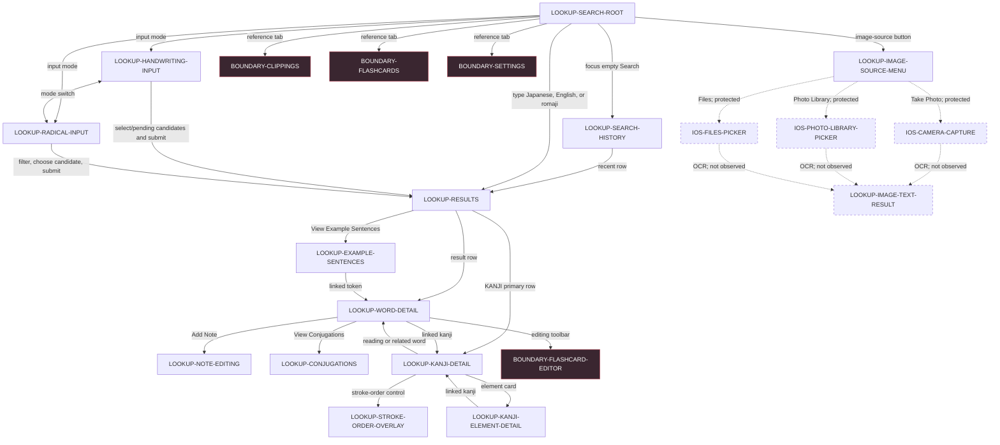

# Nihongo Search reachability map

Authority: installed Nihongo 1.34.3 (9792) on the connected iPhone 17 Pro Max, iOS 26.5.2, dark appearance, portrait orientation. This is a reconnaissance graph, not an exhaustive state-capture claim. The stakeholder approved all 16 Search-rooted journeys as `blocking`; 13 observed Nihongo-owned surfaces are `blocking`, the 3 iOS capture/picker surfaces are `navigation_support`, and the unobserved image-result placeholder remains `proposed` until discovery establishes Nihongo's actual post-selection graph.

Solid edges were traversed at runtime except the three excluded bottom-tab edges, whose entry controls were observed but intentionally not selected. Dashed edges require synthetic fixtures or further capture. The Flashcard editor boundary was entered only far enough to identify it, then immediately exited; its contents were not catalogued.

## Reconnoitred content and controls

- Search supports normal keyboard input plus handwriting and radical panels. Romaji may first rank literal Latin-script matches and offer a Japanese-reading refinement.
- Handwriting exposes an empty grid, recognition candidates, candidate composition, pending-stroke submission, erase/remove, Search, and mode switches. Radical input groups cells by stroke count, filters radicals and candidate kanji, permits deselection, and requires a candidate before Search is enabled.
- Results expose Best Matches, Additional Matches, Discovered Words, KANJI primary rows, and a query-specific Example Sentences action. Blank no-match and example-count-only punctuation states were also observed. Cancelling a populated search can leave the result set visible after focus and query text clear.
- Word Detail can expose reading, frequency, pitch-accent visualization, audio, parts of speech, meanings, alternatives, linked kanji and words, notes, examples, and conjugations.
- Example Sentences show Japanese with furigana, English translation, audio, and linked Japanese tokens.
- Kanji Detail exposes classifications, meanings, readings linked to words, elements, expandable origin/history, related words, and a stroke-order overlay. Element Detail links outward to kanji grouped by the element's role.

## Privacy and evidence limits

- No retained screenshot contains pre-existing recent-search terms, personal photos, personal files, or clipboard data.
- The retained handwriting and radical screenshots contain only the lower input panels.
- Camera, Photo Library, Files, image OCR/result, audio behavior, destructive history clearing, permission variants, offline/error/retry, Search-result terminal scrolling, software-keyboard presentation, and confirmed cold-relaunch persistence remain mapped but not fully characterized.
- Zenbu's natural-translation addition belongs to the settled Image Text Flow product authority. It must not be represented as observed Nihongo behavior.

The Search capture executed all 12 required fixture categories across 16 runs, indexing 22 in-family states, 44 actions, 4 cross-family destination proofs, and 11 materially distinct input/result behavior classes. It is not claimed complete: `search-coverage-report.json` names nine exact gaps and their resume procedures.

Machine-readable details live in `journeys.json`, `surface-map.json`, `state-transitions.json`, `search-crawl.json`, `search-fixture-matrix.json`, and `search-coverage-report.json`.
