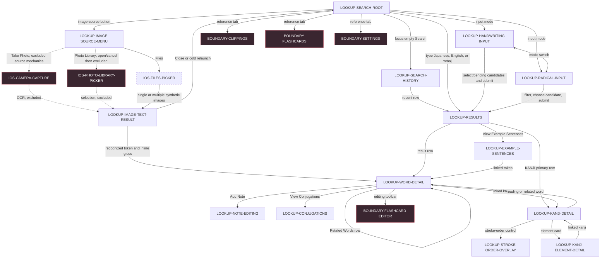

# Nihongo Search reachability map

Authority: installed Nihongo 1.34.3 (9792) on the connected iPhone 17 Pro Max, iOS 26.5.2, dark appearance, portrait orientation. This graph is backed by recursive family-specific records. The stakeholder originally approved 16 Search-rooted journeys as `blocking`, then waived Camera and Photo Library source mechanics on 2026-08-05 and accepted Files-based uploaded-image parsing as the blocking Image Text evidence path.

Solid edges were traversed at runtime except the three excluded bottom-tab edges, whose entry controls were observed but intentionally not selected. Camera and Photo Library source mechanics are dashed because the stakeholder explicitly excluded them after accepting Files-based parsing evidence. The Flashcard editor boundary was entered only far enough to identify it, then immediately exited; its contents were not catalogued.

## Reconnoitred content and controls

- Search supports normal keyboard input plus handwriting and radical panels. Romaji may first rank literal Latin-script matches and offer a Japanese-reading refinement.
- Handwriting exposes an empty grid, recognition candidates, candidate composition, pending-stroke submission, erase/remove, Search, and mode switches. Radical input groups cells by stroke count, filters radicals and candidate kanji, permits deselection, and requires a candidate before Search is enabled.
- Results expose Best Matches, Additional Matches, Discovered Words, KANJI primary rows, and a query-specific Example Sentences action. Blank no-match and example-count-only punctuation states were also observed. Cancelling a populated search can leave the result set visible after focus and query text clear.
- Word Detail can expose reading, frequency, pitch-accent visualization, audio, parts of speech, meanings, alternatives, linked kanji and words, notes, examples, and conjugations.
- Example Sentences show Japanese with furigana, English translation, audio, and linked Japanese tokens.
- Word Detail layout classes were observed across common/uncommon, rich/sparse, noun, verb, adjective, interjection, multiple-reading, alternative-kanji, and grouped Related Words fixtures. Linked example tokens and Related Words push nested Word Detail screens.
- Verb conjugations use Plain/Polite states for ru-verbs, godan verbs, `する`, and `来る`. I-adjectives instead show seven forms and na-adjectives show five forms, both without the Plain/Polite control.
- Notes support multiple rows. Done saves; leaving with Back also auto-saves. Notes persist across navigation and cold relaunch after re-querying, and deleting all synthetic text removes the note row. All synthetic note text was removed after capture.
- Kanji Detail exposes classifications, meanings, readings linked to words, elements, expandable origin/history, related words, and a stroke-order overlay. Element Detail links outward to kanji grouped by the element's role.
- Files accepts single and multiple image selection. The Image Text result highlights recognized Japanese in blue, toggles those highlights, exposes inline dictionary glosses, links into Word Detail with a Photo back route, presents multi-image page indicators, alerts on no Japanese text, and discards active image state on Close or cold relaunch.
- Clear and noisy horizontal fixtures produced materially equivalent Japanese highlights. Sparse `静` produced an interactive `せい / stillness` gloss. Vertical text was interactive but exposed a cross-column grouping limitation: selecting `読` produced `読本` by combining adjacent-column `本`.

## Privacy and evidence limits

- No retained screenshot contains pre-existing recent-search terms, personal photos, personal files, or clipboard data.
- The retained handwriting and radical screenshots contain only the lower input panels.
- Camera and Photo Library source mechanics are excluded under the stakeholder's 2026-08-05 decision. Files-based image parsing is characterized across clear, noisy, vertical, sparse, empty, and multi-image classes; exact Copy Text serialization remains unavailable to the current device-local clipboard authority.
- Word and sentence audio content/timing, unavailable-audio fixtures, note software-keyboard presentation, long-press and interactive swipe-back gestures, word/detail offline/failure/retry, and a settled linked-kanji edge screenshot remain exact word-family gaps.
- Zenbu's natural-translation addition belongs to the settled Image Text Flow product authority. It must not be represented as observed Nihongo behavior.

The Search capture executed all 12 required fixture categories across 16 runs, indexing 22 in-family states, 44 actions, 4 cross-family destination proofs, and 11 materially distinct input/result behavior classes. It is not claimed complete: `search-coverage-report.json` names nine exact gaps and their resume procedures.

Machine-readable details live in `journeys.json`, `surface-map.json`, `state-transitions.json`, `search-crawl.json`, `search-fixture-matrix.json`, and `search-coverage-report.json`.

The Image Text capture executed five purpose-created fixtures across three runs, indexing 16 states, 25 actions, 10 behavior/layout classes, and 10 privacy-reviewed screenshots. Uploaded-image parsing is complete for the revised stakeholder scope; `image-coverage-report.json` records the observed vertical grouping limitation and the nonblocking Copy Text output gap.

Image Text machine-readable details live in `image-crawl.json`, `image-fixture-matrix.json`, `image-coverage-report.json`, `image-evidence-manifest.json`, and `evidence/reference/interaction-traces/image-text-inventory.json`.

The word/detail capture executed 10 fixture runs, indexing 23 in-family states, 32 actions, 12 materially distinct behavior/layout classes, and 42 privacy-reviewed screenshots. It is not claimed complete: `word-coverage-report.json` names six exact gaps and `word-evidence-manifest.json` registers only post-audit settled frames.

Word/detail machine-readable details live in `word-crawl.json`, `word-fixture-matrix.json`, `word-coverage-report.json`, and `word-evidence-manifest.json`.
