# Nihongo Search reference review

Status: **incomplete reference-app discovery — blocking gaps remain**

Captured: 2026-08-04

Reference authority: installed Nihongo 1.34.3 (9792) on a physical iPhone 17 Pro Max running iOS 26.5.2, in dark appearance and portrait orientation

Discovery scope: Nihongo's Search entry, input modes, query/result variants, history, and the proven entry edges to nested Lookup surfaces

This is the human-review layer for the canonical dossier at [`docs/clone-discovery/nihongo/`](../../../../clone-discovery/nihongo/). It does not copy or replace the dossier's claims. Each annotation points back to stable fixture, state, or action IDs in the canonical records.

## Review status

The Search capture executed all 12 required fixture categories across 16 runs and currently records:

| Measure | Recorded |
| --- | ---: |
| In-family states | 22 |
| Actions | 44 |
| Traversed actions | 27 |
| Same-destination actions | 1 |
| Cross-family destination proofs | 4 |
| Distinct input/result behavior classes | 11 |
| Privacy-reviewed screenshots displayed below | 34 |
| Blocking or unresolved Search gaps | 9 |

Canonical records:

- [Fixture matrix](../../../../clone-discovery/nihongo/search-fixture-matrix.json) — why each query exists, its input method, observed behavior class, and evidence.
- [Search crawl](../../../../clone-discovery/nihongo/search-crawl.json) — stable state and action IDs with tested dispositions.
- [Coverage report](../../../../clone-discovery/nihongo/search-coverage-report.json) — reconciled counts and exact unresolved gaps.
- [Evidence manifest](../../../../clone-discovery/nihongo/search-evidence-manifest.json) — SHA-256 and path for every screenshot below.
- [Reachability map](../../../../clone-discovery/nihongo/reachability-map.md) — the wider Search-rooted navigation graph.

## Table of contents

- [tldraw interaction board](#tldraw-interaction-board) — editable screenshot nodes and observed “select this → reach this” paths.
- [Screenshot index](#screenshot-index--all-34-retained-captures) — a jump link for every retained capture.
- [Feature index](#feature-index) — the same evidence grouped by product area.
- [Search entry, focus, and history](#search-entry-focus-and-history)
- [Query and result classes](#query-and-result-classes)
- [Handwriting input](#handwriting-input)
- [Radical input](#radical-input)
- [Proven nested destination edges](#proven-nested-destination-edges)
- [Lifecycle restoration probe](#lifecycle-restoration-probe)
- [Blocking gaps](#blocking-gaps)
- [Privacy and interpretation rules](#privacy-and-interpretation-rules)

## tldraw interaction board

[Open the editable Nihongo Search board](boards/nihongo-search-interaction-board.tldr).

The first frame places screenshots directly on the canvas and connects them with ten labeled arrows such as “type/edit query · `SEARCH-ACTION-002`” and “select word row/glyph · `SEARCH-ACTION-007/008`.” Six additional frames display all 34 retained captures by feature area.

The `.tldr` file is the editable source, not a flattened export. It contains:

- 34 embedded screenshot assets, so the board does not depend on local file URLs;
- 44 image shapes: ten reused in the interaction flow and all 34 in the evidence gallery;
- editable screen labels and action arrows;
- canonical annotations, source screenshot names, capture numbers, and role labels in shape metadata;
- links from screenshot and label shapes back to the corresponding annotation in this README.

Agents can read, search, and update the board through the disk-backed tldraw MCP server by setting `TLDRAW_DIR` to this `boards/` directory. The Markdown screenshot index below remains the fastest non-canvas navigation path.

## Screenshot index — all 34 retained captures

“Screen” below means one retained visual state or action-result capture. Each link jumps to the full annotation and visible screenshot later in this document.

| # | Area | Screen or capture | Canonical annotation |
| ---: | --- | --- | --- |
| 1 | Entry | [Empty Search root](#capture-search-root-empty) | `SEARCH-STATE-001` |
| 2 | Entry | [Cancel preserves populated results](#capture-action-cancel-preserves-results) | `SEARCH-ACTION-004` → `SEARCH-STATE-020` |
| 3 | History | [Disposable recent-search rerun](#capture-action-history-rerun-disposable-mondai) | `SEARCH-FIXTURE-013`, `SEARCH-ACTION-026` |
| 4 | Results | [Common Japanese entered as kanji: 日本](#capture-fixture-common-kanji-nihon-handwritten) | `SEARCH-FIXTURE-001` |
| 5 | Results | [Literal romaji: nihon](#capture-fixture-romaji-nihon-live) | `SEARCH-FIXTURE-004`, `SEARCH-STATE-004` |
| 6 | Results | [Refined reading: にほん](#capture-fixture-romaji-nihon-refined) | `SEARCH-FIXTURE-002`, `SEARCH-ACTION-005`, `SEARCH-STATE-005` |
| 7 | Results | [Single-kanji query: 丁](#capture-fixture-single-kanji-handwritten-cho) | `SEARCH-FIXTURE-006`, `SEARCH-STATE-012` |
| 8 | Results | [English ambiguity: think](#capture-fixture-english-think-live) | `SEARCH-FIXTURE-003`, `SEARCH-STATE-006` |
| 9 | Results | [Inflected input: tabeta](#capture-fixture-inflected-tabeta-live) | `SEARCH-FIXTURE-005`, `SEARCH-STATE-007` |
| 10 | Results | [Direct romaji resolution: taberu](#capture-fixture-romaji-taberu-direct-deinflection) | Unindexed manifest-only evidence |
| 11 | Results | [Trailing whitespace: taberu](#capture-fixture-whitespace-taberu-trailing) | `SEARCH-FIXTURE-010`, `SEARCH-STATE-022` |
| 12 | Results | [Partial input: tab](#capture-fixture-partial-tab) | `SEARCH-FIXTURE-009`, `SEARCH-STATE-021` |
| 13 | Results | [Mixed script: にほんabc](#capture-fixture-mixed-script-nihon-abc) | `SEARCH-FIXTURE-011`, `SEARCH-STATE-009` |
| 14 | Results | [Punctuation: hello-world](#capture-fixture-punctuation-hello-hyphen-world) | `SEARCH-FIXTURE-014`, `SEARCH-STATE-011` |
| 15 | Results | [No match: zzzxqv](#capture-fixture-no-match-zzzxqv) | `SEARCH-FIXTURE-012`, `SEARCH-STATE-010` |
| 16 | Results | [Rich result, literal romaji: mondai](#capture-fixture-rich-mondai-live) | `SEARCH-FIXTURE-007` |
| 17 | Results | [Rich result, refined reading: もんだい](#capture-fixture-rich-mondai-refined) | `SEARCH-FIXTURE-007` |
| 18 | Results | [Sparse result: tondemonai](#capture-fixture-sparse-tondemonai-live) | `SEARCH-FIXTURE-008`, `SEARCH-STATE-008` |
| 19 | Handwriting | [Empty handwriting panel](#capture-state-handwriting-empty-crop) | `SEARCH-STATE-013` |
| 20 | Handwriting | [Drawn strokes and candidates](#capture-state-handwriting-drawn-candidates) | `SEARCH-ACTION-013` → `SEARCH-STATE-014` |
| 21 | Handwriting | [Erase/remove diagnostic](#capture-action-handwriting-erase) | `SEARCH-ACTION-015` — unavailable |
| 22 | Handwriting | [Pending-stroke submission](#capture-action-handwriting-submit-pending-stroke-discovered-words) | `SEARCH-FIXTURE-015`, `SEARCH-ACTION-017` |
| 23 | Radicals | [Unselected radical grid](#capture-state-radical-empty) | `SEARCH-STATE-017` |
| 24 | Radicals | [Selected radical and filtered candidates](#capture-state-radical-selected) | `SEARCH-ACTION-020` → `SEARCH-STATE-018` |
| 25 | Radicals | [Remove selected radical](#capture-action-radical-remove) | `SEARCH-ACTION-021` |
| 26 | Radicals | [Choose candidate and submit: 薮](#capture-action-radical-candidate-submit-yabu) | `SEARCH-FIXTURE-016`, `SEARCH-ACTION-023/024` |
| 27 | Radicals | [Submission without candidate diagnostic](#capture-action-radical-search-without-candidate-returns-root) | `SEARCH-ACTION-025` — unavailable |
| 28 | Destination | [View Example Sentences](#capture-edge-results-to-example-sentences-settled) | `SEARCH-ACTION-006` |
| 29 | Destination | [Best Match to Word Detail](#capture-edge-results-to-word-detail-mondai-settled) | `SEARCH-ACTION-007` |
| 30 | Destination | [Leading result-row glyph to Word Detail](#capture-action-result-leading-glyph-same-word-detail-settled) | `SEARCH-ACTION-008` |
| 31 | Destination | [Additional Match to Word Detail](#capture-edge-additional-result-to-word-detail-mondaika) | `SEARCH-ACTION-007` with Additional Match |
| 32 | Destination | [KANJI primary row to Kanji Detail](#capture-edge-results-to-kanji-detail-yabu) | `SEARCH-ACTION-009` |
| 33 | Destination | [Image-source menu](#capture-edge-search-to-image-source-menu) | `SEARCH-ACTION-010` |
| 34 | Lifecycle | [App-switcher/Spotlight restoration](#capture-state-relaunch-restores-word-detail) | `SEARCH-ACTION-031` |

## Feature index

| Review area | Canonical surfaces | What is shown |
| --- | --- | --- |
| [Search entry and history](#search-entry-focus-and-history) | `LOOKUP-SEARCH-ROOT`, `LOOKUP-SEARCH-HISTORY` | Empty root, Cancel behavior, disposable history rerun |
| [Query and result classes](#query-and-result-classes) | `LOOKUP-RESULTS` | Japanese, kana, English, romaji, deinflection, partial, mixed, punctuation, no-match, sparse, and kanji-primary states |
| [Handwriting](#handwriting-input) | `LOOKUP-HANDWRITING-INPUT` | Empty grid, candidates, composition, pending-stroke submission, erase ambiguity |
| [Radicals](#radical-input) | `LOOKUP-RADICAL-INPUT` | Grouped grid, selection, filtering, removal, candidate choice, submission |
| [Nested destinations](#proven-nested-destination-edges) | Example Sentences, Word Detail, Kanji Detail, image-source menu | Proven entry edges only; recursive behavior is owned by later capture tickets |
| [Lifecycle](#lifecycle-restoration-probe) | Word Detail restoration | App-switcher/Spotlight round trip; not a proven cold relaunch |

## Search entry, focus, and history

<table>
  <tr>
    <td width="50%" valign="top">
      <a id="capture-search-root-empty" href="../../../../clone-discovery/nihongo/evidence/reference/screenshots/search-inventory/search-root-empty.png">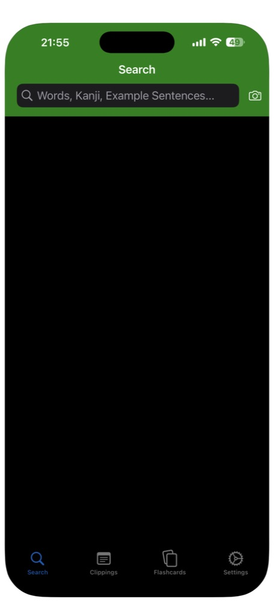</a> 
      <strong>Empty Search root</strong> 
      <code>SEARCH-STATE-001</code> 
      The unfocused root exposes the Search field, image-source button, and reference bottom-navigation boundaries. No result or empty-state copy is shown.
    </td>
    <td width="50%" valign="top">
       
      <strong>Cancel preserves populated results</strong> 
      <code>SEARCH-ACTION-004</code> → <code>SEARCH-STATE-020</code> 
      Cancelling focus removes the focused-input presentation while the settled result set remains visible.
    </td>
  </tr>
  <tr>
    <td width="50%" valign="top">
      <a id="capture-action-history-rerun-disposable-mondai" href="../../../../clone-discovery/nihongo/evidence/reference/screenshots/search-inventory/action-history-rerun-disposable-mondai.png">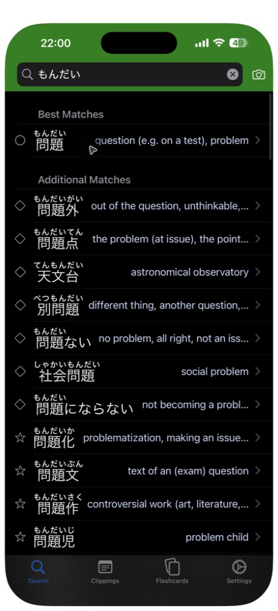</a> 
      <strong>Disposable recent-search rerun</strong> 
      <code>SEARCH-FIXTURE-013</code>, <code>SEARCH-ACTION-026</code> 
      Selecting the known session-created もんだい row restored the expected result set. The history list itself is intentionally not retained because it contained older non-session rows.
    </td>
    <td width="50%" valign="top">
      <strong>Privacy boundary</strong>  
      No pre-existing history entry was selected, transcribed, or retained. <em>Clear All</em> was excluded because it would delete data outside the synthetic fixture scope. Individual disposable-row removal remains <code>SEARCH-GAP-HISTORY-REMOVE</code>.
    </td>
  </tr>
</table>

## Query and result classes

### Japanese and reading refinement

<table>
  <tr>
    <td width="50%" valign="top">
      <a id="capture-fixture-common-kanji-nihon-handwritten" href="../../../../clone-discovery/nihongo/evidence/reference/screenshots/search-inventory/fixture-common-kanji-nihon-handwritten.png">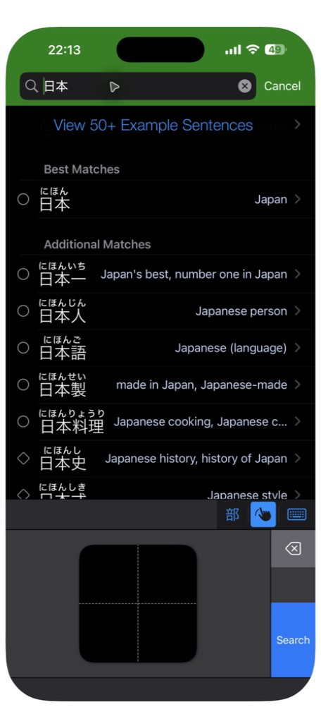</a> 
      <strong>Common Japanese entered as kanji: 日本</strong> 
      <code>SEARCH-FIXTURE-001</code>, <code>RESULT-STANDARD-RANKED</code> 
      The result shows View 50+ Example Sentences, a Best Match headed by 日本, and Additional Matches.
    </td>
    <td width="50%" valign="top">
      <a id="capture-fixture-romaji-nihon-live" href="../../../../clone-discovery/nihongo/evidence/reference/screenshots/search-inventory/fixture-romaji-nihon-live.png">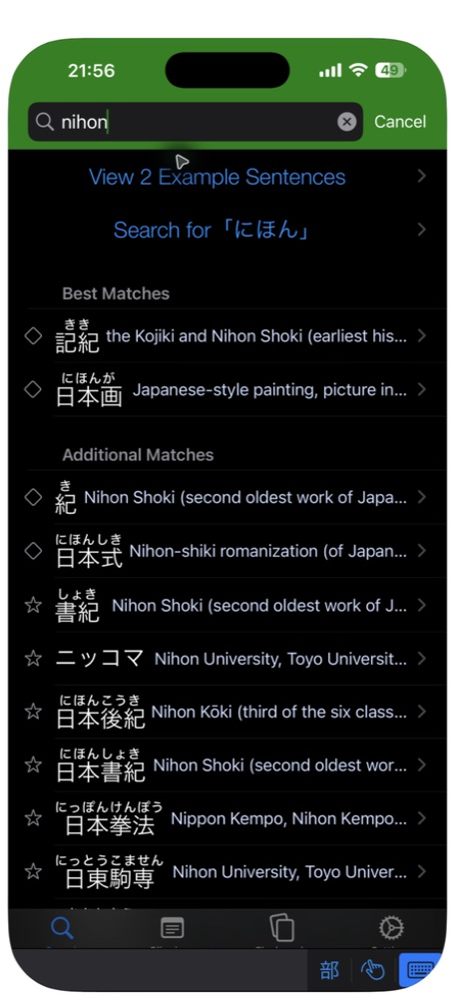</a> 
      <strong>Literal romaji: nihon</strong> 
      <code>SEARCH-FIXTURE-004</code>, <code>SEARCH-STATE-004</code> 
      Literal Latin-script matches appear first, alongside a visible <em>Search for 「にほん」</em> refinement action.
    </td>
  </tr>
  <tr>
    <td width="50%" valign="top">
      <a id="capture-fixture-romaji-nihon-refined" href="../../../../clone-discovery/nihongo/evidence/reference/screenshots/search-inventory/fixture-romaji-nihon-refined.png">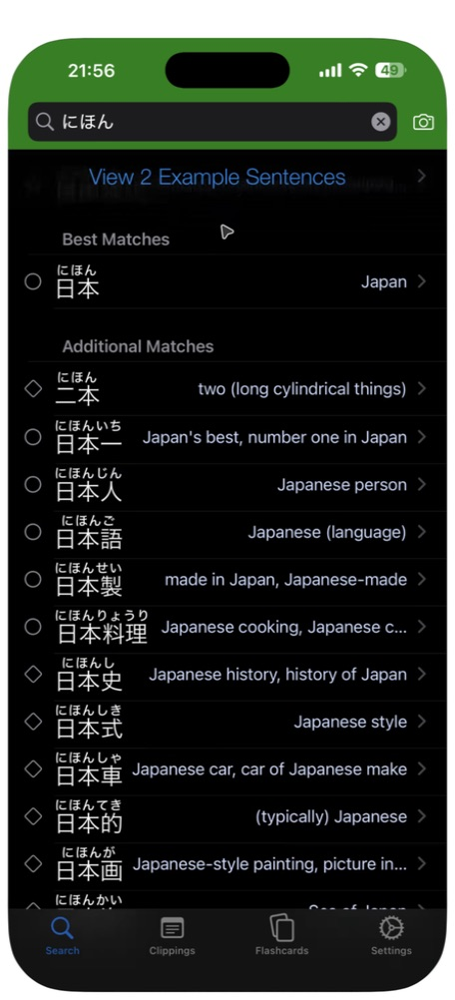</a> 
      <strong>Refined reading: にほん</strong> 
      <code>SEARCH-FIXTURE-002</code>, <code>SEARCH-ACTION-005</code>, <code>SEARCH-STATE-005</code> 
      Selecting the refinement replaces the field with にほん and reranks results around 日本 and related entries.
    </td>
    <td width="50%" valign="top">
      <a id="capture-fixture-single-kanji-handwritten-cho" href="../../../../clone-discovery/nihongo/evidence/reference/screenshots/search-inventory/fixture-single-kanji-handwritten-cho.png">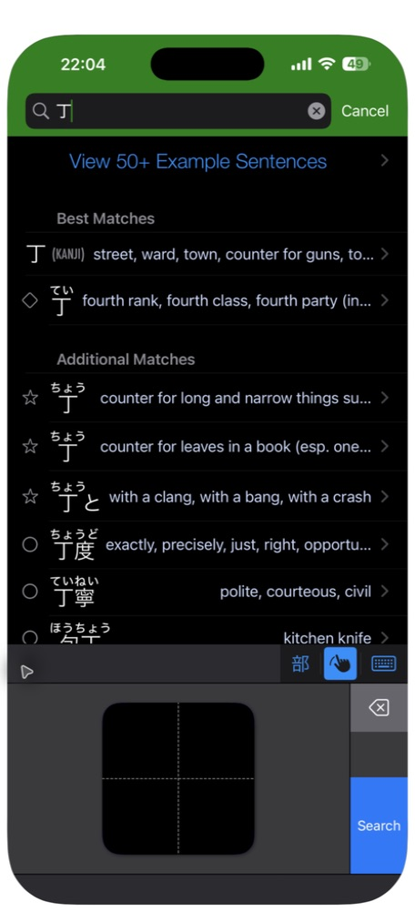</a> 
      <strong>Single-kanji query: 丁</strong> 
      <code>SEARCH-FIXTURE-006</code>, <code>SEARCH-STATE-012</code> 
      A KANJI primary row appears above word Best Matches, Additional Matches, and View 50+ Example Sentences.
    </td>
  </tr>
</table>

### English, ambiguity, and deinflection

<table>
  <tr>
    <td width="50%" valign="top">
      <a id="capture-fixture-english-think-live" href="../../../../clone-discovery/nihongo/evidence/reference/screenshots/search-inventory/fixture-english-think-live.png">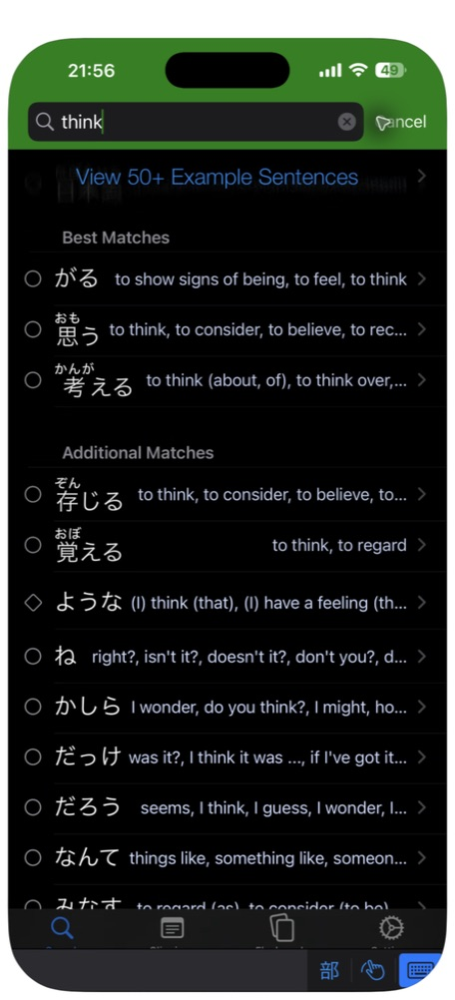</a> 
      <strong>English ambiguity: think</strong> 
      <code>SEARCH-FIXTURE-003</code>, <code>SEARCH-STATE-006</code> 
      Three Best Matches and a long Additional Matches section span several grammatical and match classes; View 50+ Example Sentences is present.
    </td>
    <td width="50%" valign="top">
      <a id="capture-fixture-inflected-tabeta-live" href="../../../../clone-discovery/nihongo/evidence/reference/screenshots/search-inventory/fixture-inflected-tabeta-live.png">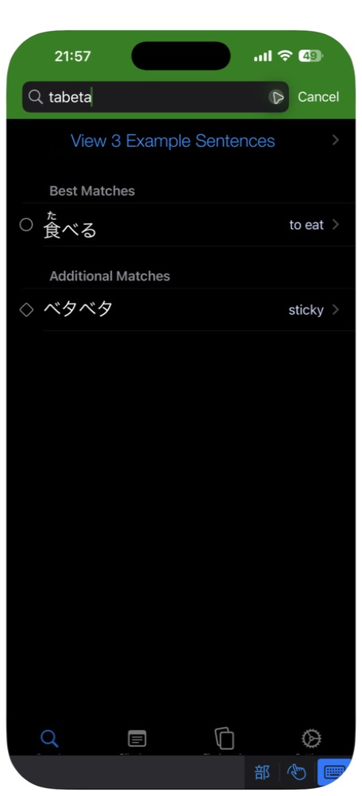</a> 
      <strong>Inflected input: tabeta</strong> 
      <code>SEARCH-FIXTURE-005</code>, <code>SEARCH-STATE-007</code> 
      The Best Match resolves to 食べる (to eat), while ベタベタ remains an Additional Match.
    </td>
  </tr>
  <tr>
    <td width="50%" valign="top">
      <a id="capture-fixture-romaji-taberu-direct-deinflection" href="../../../../clone-discovery/nihongo/evidence/reference/screenshots/search-inventory/fixture-romaji-taberu-direct-deinflection.png">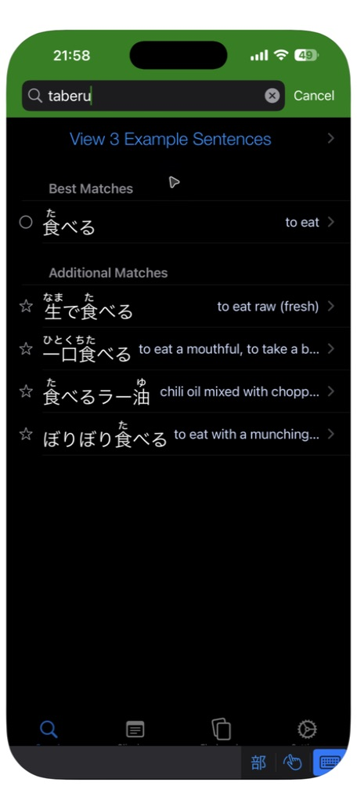</a> 
      <strong>Direct romaji resolution: taberu</strong> 
      Unindexed supplemental evidence — manifest artifact only; no fixture, state, or action ID was assigned 
      Behavior class: <code>RESULT-DEINFLECTED-ROMAJI</code> 
      Unlike <em>nihon</em> and <em>mondai</em>, this input resolves directly to 食べる without presenting a separate Japanese-reading refinement row.
    </td>
    <td width="50%" valign="top">
      <a id="capture-fixture-whitespace-taberu-trailing" href="../../../../clone-discovery/nihongo/evidence/reference/screenshots/search-inventory/fixture-whitespace-taberu-trailing.png">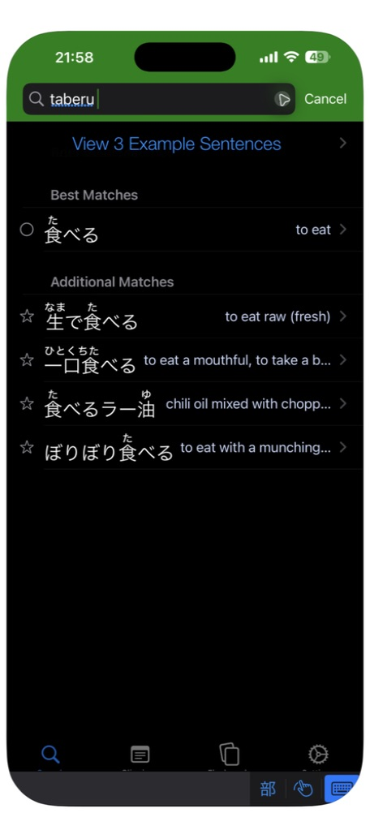</a> 
      <strong>Trailing whitespace: <code>taberu&nbsp;</code></strong> 
      <code>SEARCH-FIXTURE-010</code>, <code>SEARCH-STATE-022</code> 
      The trailing space is not visibly retained and the result class matches the direct <em>taberu</em> behavior.
    </td>
  </tr>
</table>

### Partial, mixed, punctuation, and no-match input

<table>
  <tr>
    <td width="50%" valign="top">
      <a id="capture-fixture-partial-tab" href="../../../../clone-discovery/nihongo/evidence/reference/screenshots/search-inventory/fixture-partial-tab.png">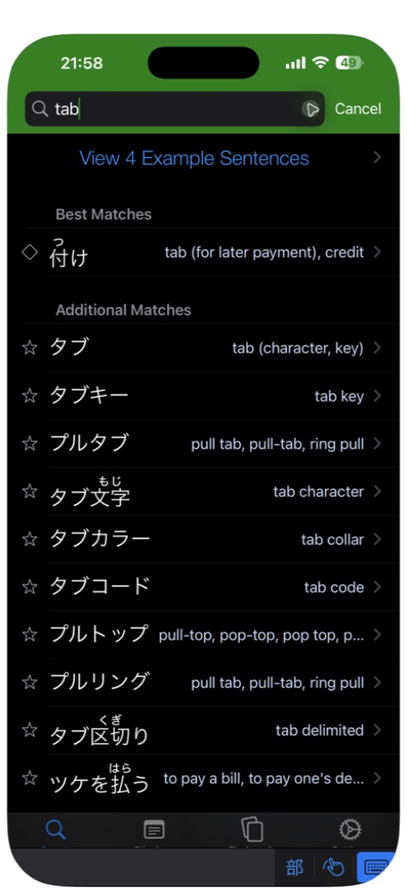</a> 
      <strong>Partial input: tab</strong> 
      <code>SEARCH-FIXTURE-009</code>, <code>SEARCH-STATE-021</code> 
      Results update live before submission with an example count, a Best Match, and many Additional Matches.
    </td>
    <td width="50%" valign="top">
      <a id="capture-fixture-mixed-script-nihon-abc" href="../../../../clone-discovery/nihongo/evidence/reference/screenshots/search-inventory/fixture-mixed-script-nihon-abc.png">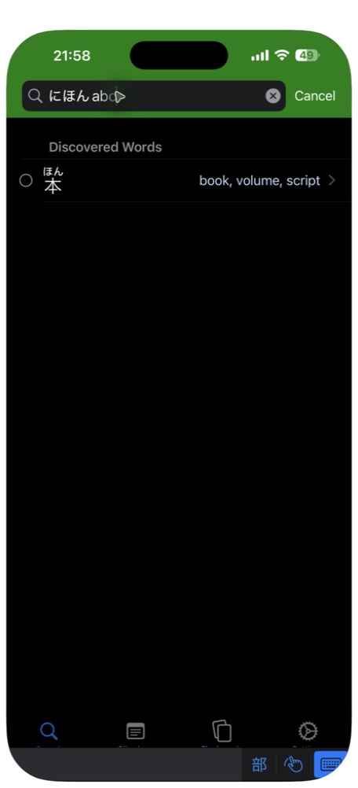</a> 
      <strong>Mixed script: にほんabc</strong> 
      <code>SEARCH-FIXTURE-011</code>, <code>SEARCH-STATE-009</code> 
      Best/Additional headings are replaced by <em>Discovered Words</em>, containing 本.
    </td>
  </tr>
  <tr>
    <td width="50%" valign="top">
      <a id="capture-fixture-punctuation-hello-hyphen-world" href="../../../../clone-discovery/nihongo/evidence/reference/screenshots/search-inventory/fixture-punctuation-hello-hyphen-world.png">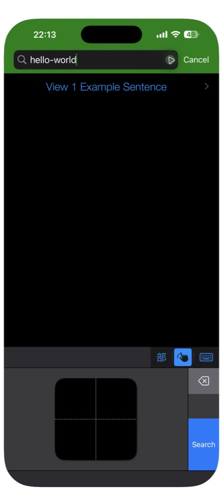</a> 
      <strong>Punctuation: hello-world</strong> 
      <code>SEARCH-FIXTURE-014</code>, <code>SEARCH-STATE-011</code> 
      View 1 Example Sentence appears without Best Matches, Additional Matches, Discovered Words, or explicit no-match copy.
    </td>
    <td width="50%" valign="top">
      <a id="capture-fixture-no-match-zzzxqv" href="../../../../clone-discovery/nihongo/evidence/reference/screenshots/search-inventory/fixture-no-match-zzzxqv.png">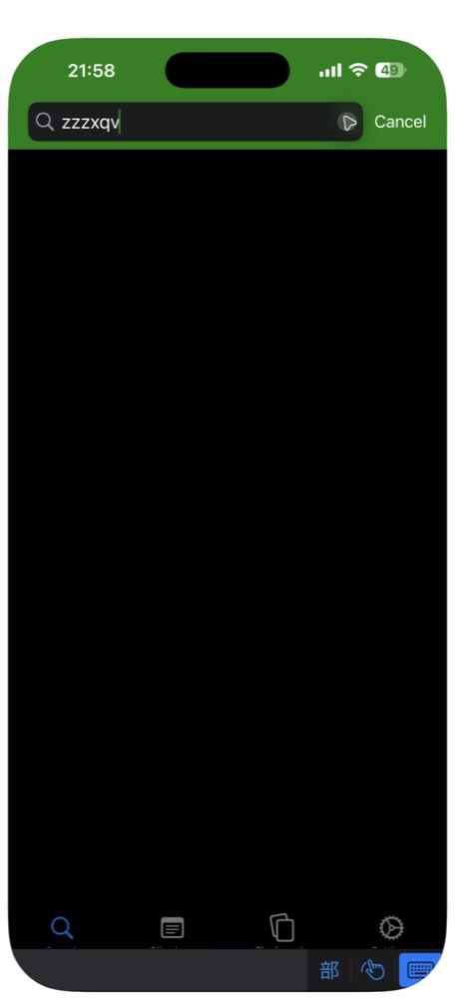</a> 
      <strong>No match: zzzxqv</strong> 
      <code>SEARCH-FIXTURE-012</code>, <code>SEARCH-STATE-010</code> 
      The populated field remains above a blank content area. No explicit empty-state message or retry control is visible.
    </td>
  </tr>
</table>

### Rich and sparse ranked layouts

<table>
  <tr>
    <td width="50%" valign="top">
      <a id="capture-fixture-rich-mondai-live" href="../../../../clone-discovery/nihongo/evidence/reference/screenshots/search-inventory/fixture-rich-mondai-live.png">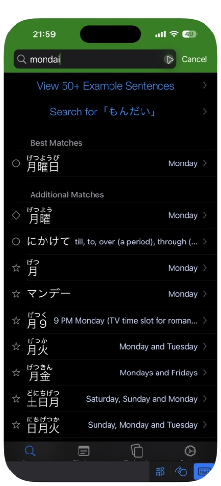</a> 
      <strong>Rich result, literal romaji: mondai</strong> 
      <code>SEARCH-FIXTURE-007</code> 
      The literal state precedes Nihongo's Japanese-reading refinement.
    </td>
    <td width="50%" valign="top">
       
      <strong>Rich result, refined reading: もんだい</strong> 
      <code>SEARCH-FIXTURE-007</code>, <code>RESULT-STANDARD-RANKED</code> 
      問題 is the Best Match above a dense Additional Matches list. The Word Detail entry edge is shown later.
    </td>
  </tr>
  <tr>
    <td width="50%" valign="top">
      <a id="capture-fixture-sparse-tondemonai-live" href="../../../../clone-discovery/nihongo/evidence/reference/screenshots/search-inventory/fixture-sparse-tondemonai-live.png">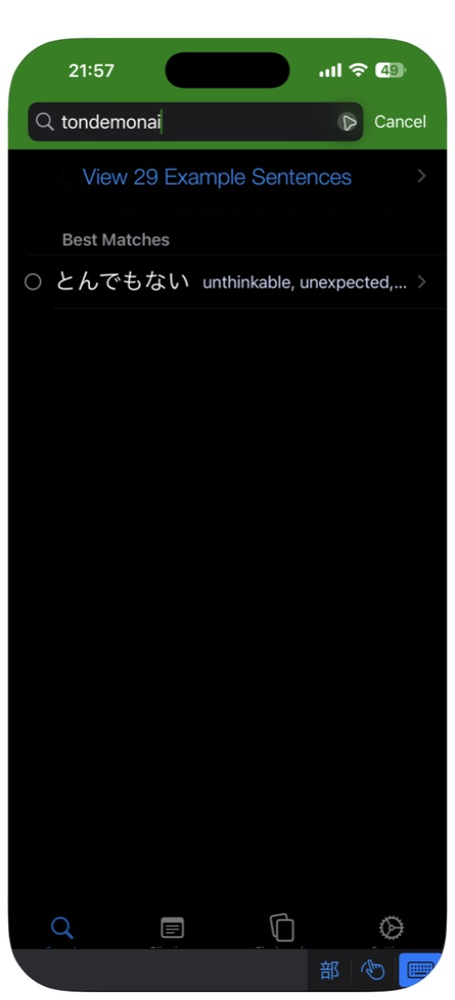</a> 
      <strong>Sparse result: tondemonai</strong> 
      <code>SEARCH-FIXTURE-008</code>, <code>SEARCH-STATE-008</code> 
      One Best Match and View 29 Example Sentences are present; Additional Matches is absent.
    </td>
    <td width="50%" valign="top">
      <strong>What these layouts do not prove</strong>  
      The current controller could not reliably scroll a long result list to its terminal extent. Pagination, lazy loading, terminal-row behavior, and scroll-position restoration remain <code>SEARCH-GAP-RESULT-SCROLL</code>.
    </td>
  </tr>
</table>

## Handwriting input

<table>
  <tr>
    <td width="50%" valign="top">
      <a id="capture-state-handwriting-empty-crop" href="../../../../clone-discovery/nihongo/evidence/reference/screenshots/search-inventory/state-handwriting-empty-crop.jpg">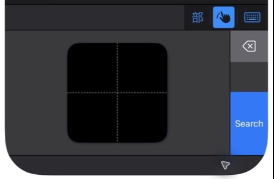</a> 
      <strong>Empty handwriting panel</strong> 
      <code>SEARCH-STATE-013</code> 
      The custom panel exposes a drawing grid, erase/remove control, Search, radical mode, and keyboard mode.
    </td>
    <td width="50%" valign="top">
      <a id="capture-state-handwriting-drawn-candidates" href="../../../../clone-discovery/nihongo/evidence/reference/screenshots/search-inventory/state-handwriting-drawn-candidates.png">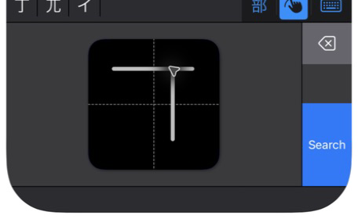</a> 
      <strong>Drawn strokes and candidates</strong> 
      <code>SEARCH-ACTION-013</code> → <code>SEARCH-STATE-014</code> 
      Drawing a synthetic 丁-like shape produces a candidate strip containing 丁, 几, and イ.
    </td>
  </tr>
  <tr>
    <td width="50%" valign="top">
      <a id="capture-action-handwriting-erase" href="../../../../clone-discovery/nihongo/evidence/reference/screenshots/search-inventory/action-handwriting-erase.png">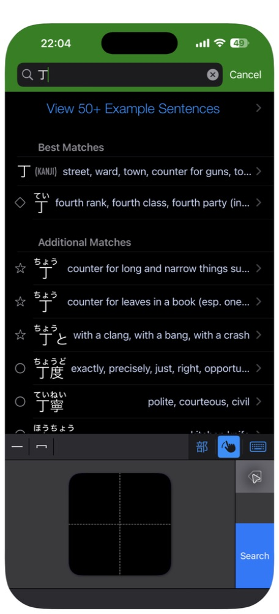</a> 
      <strong>Erase/remove diagnostic</strong> 
      <code>SEARCH-ACTION-015</code> — <code>unavailable_under_fixture</code> 
      This image records the attempted erase state, but it does <em>not</em> prove successful single-stroke removal: the later Search included the pending 一 recognition. Exact erase semantics remain <code>SEARCH-GAP-HANDWRITING-ERASE</code>.
    </td>
    <td width="50%" valign="top">
      <a id="capture-action-handwriting-submit-pending-stroke-discovered-words" href="../../../../clone-discovery/nihongo/evidence/reference/screenshots/search-inventory/action-handwriting-submit-pending-stroke-discovered-words.png">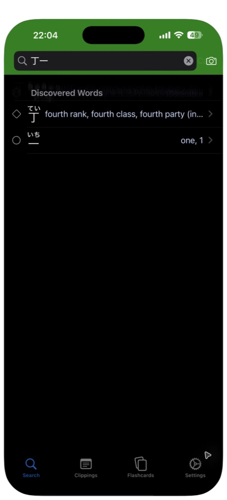</a> 
      <strong>Pending-stroke submission</strong> 
      <code>SEARCH-FIXTURE-015</code>, <code>SEARCH-ACTION-017</code> 
      Selecting Search with 丁 already chosen and another recognized stroke pending submits 丁一 and produces the Discovered Words result class.
    </td>
  </tr>
</table>

## Radical input

<table>
  <tr>
    <td width="50%" valign="top">
      <a id="capture-state-radical-empty" href="../../../../clone-discovery/nihongo/evidence/reference/screenshots/search-inventory/state-radical-empty.png">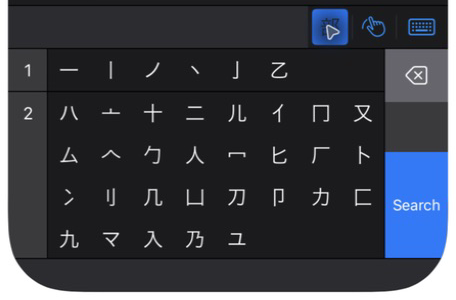</a> 
      <strong>Unselected radical grid</strong> 
      <code>SEARCH-STATE-017</code> 
      Radical cells are grouped by stroke count. The panel also exposes remove, Search, handwriting mode, and keyboard mode.
    </td>
    <td width="50%" valign="top">
      <a id="capture-state-radical-selected" href="../../../../clone-discovery/nihongo/evidence/reference/screenshots/search-inventory/state-radical-selected.png">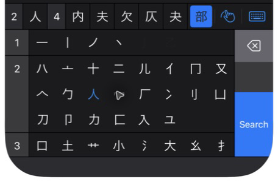</a> 
      <strong>Selected radical and filtered candidates</strong> 
      <code>SEARCH-ACTION-020</code> → <code>SEARCH-STATE-018</code> 
      A selected radical highlights blue while the available radical cells and candidate-kanji strip filter.
    </td>
  </tr>
  <tr>
    <td width="50%" valign="top">
      <a id="capture-action-radical-remove" href="../../../../clone-discovery/nihongo/evidence/reference/screenshots/search-inventory/action-radical-remove.png">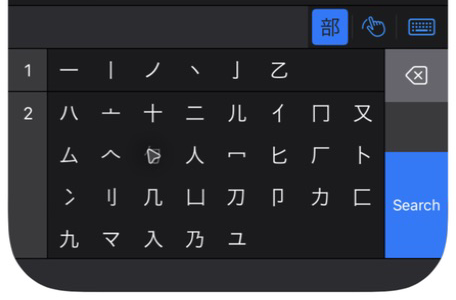</a> 
      <strong>Remove selected radical</strong> 
      <code>SEARCH-ACTION-021</code> 
      Selecting the highlighted radical again removes it and expands the available grid.
    </td>
    <td width="50%" valign="top">
      <a id="capture-action-radical-candidate-submit-yabu" href="../../../../clone-discovery/nihongo/evidence/reference/screenshots/search-inventory/action-radical-candidate-submit-yabu.png">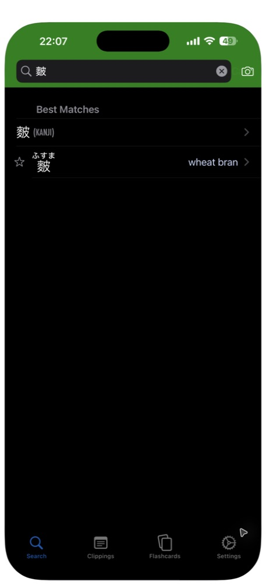</a> 
      <strong>Choose candidate and submit: 薮</strong> 
      <code>SEARCH-FIXTURE-016</code>, <code>SEARCH-ACTION-023</code>–<code>024</code> 
      Choosing the filtered candidate populates Search, enables submission, and produces a KANJI primary row plus one word result.
    </td>
  </tr>
  <tr>
    <td width="50%" valign="top">
      <a id="capture-action-radical-search-without-candidate-returns-root" href="../../../../clone-discovery/nihongo/evidence/reference/screenshots/search-inventory/action-radical-search-without-candidate-returns-root.png">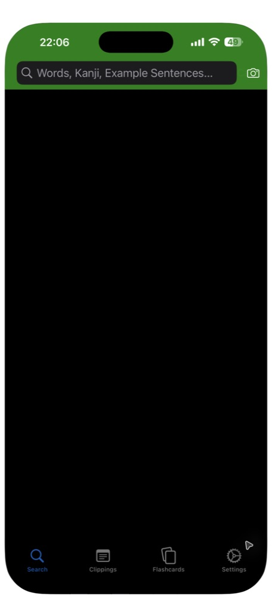</a> 
      <strong>Submission without a chosen candidate — diagnostic only</strong> 
      <code>SEARCH-ACTION-025</code> — <code>unavailable_under_fixture</code> 
      Do not infer a transition from this artifact. The settled panel showed Search disabled until a candidate was chosen; zero-candidate and very-large candidate-set behavior remain unresolved.
    </td>
    <td width="50%" valign="top">
      <strong>Remaining radical coverage</strong>  
      Selection, deselection, multi-radical narrowing, candidate choice, and successful submission are observed. Zero-result filtering and very large candidate sets remain <code>SEARCH-GAP-RADICAL-ZERO-AND-LARGE-SETS</code>.
    </td>
  </tr>
</table>

## Proven nested destination edges

These images prove that the Search result controls reach the named destinations. They do not claim recursive coverage of those destinations; the owning capture tickets remain authoritative for their internal controls and states.

<table>
  <tr>
    <td width="50%" valign="top">
      <a id="capture-edge-results-to-example-sentences-settled" href="../../../../clone-discovery/nihongo/evidence/reference/screenshots/search-inventory/edge-results-to-example-sentences-settled.png">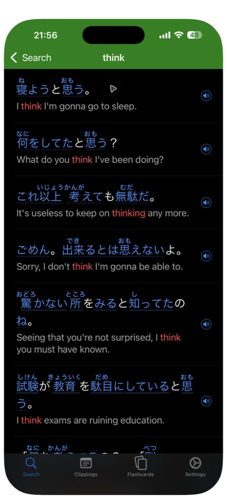</a> 
      <strong>View Example Sentences</strong> 
      <code>SEARCH-ACTION-006</code> → <code>LOOKUP-EXAMPLE-SENTENCES</code> 
      The <em>think</em> result opens a populated, furigana-bearing example list with per-row speaker controls.
    </td>
    <td width="50%" valign="top">
      <a id="capture-edge-results-to-word-detail-mondai-settled" href="../../../../clone-discovery/nihongo/evidence/reference/screenshots/search-inventory/edge-results-to-word-detail-mondai-settled.png">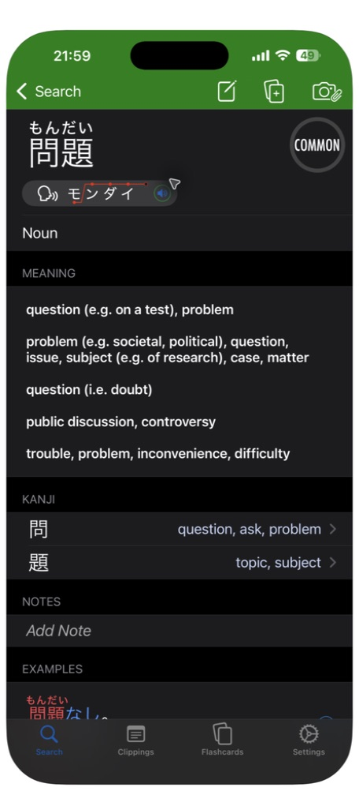</a> 
      <strong>Best Match to Word Detail</strong> 
      <code>SEARCH-ACTION-007</code> → <code>LOOKUP-WORD-DETAIL</code> 
      Selecting 問題 reaches a common Word Detail with reading, frequency, pitch display, speaker, meanings, linked kanji, notes, and examples.
    </td>
  </tr>
  <tr>
    <td width="50%" valign="top">
      <a id="capture-action-result-leading-glyph-same-word-detail-settled" href="../../../../clone-discovery/nihongo/evidence/reference/screenshots/search-inventory/action-result-leading-glyph-same-word-detail-settled.png">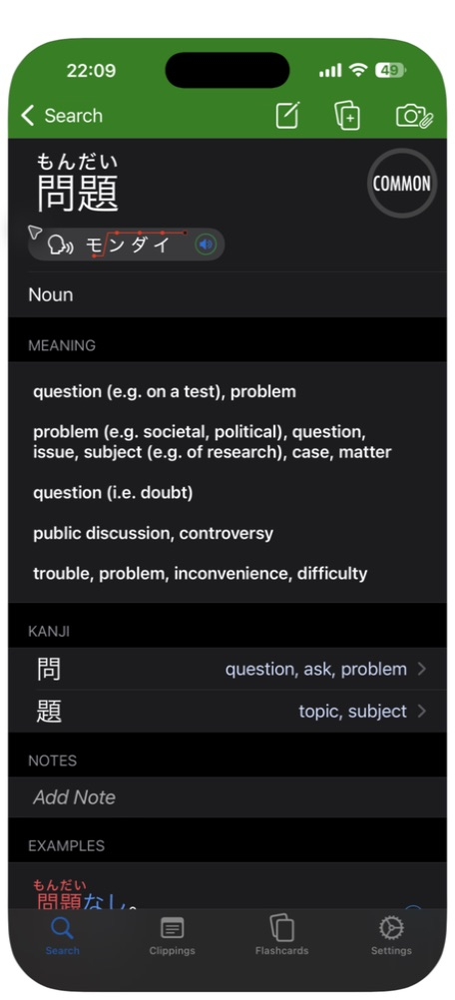</a> 
      <strong>Leading row glyph</strong> 
      <code>SEARCH-ACTION-008</code> — <code>same_destination_as SEARCH-ACTION-007</code> 
      Selecting the leading result glyph reaches the same 問題 Word Detail as selecting the row.
    </td>
    <td width="50%" valign="top">
      <a id="capture-edge-additional-result-to-word-detail-mondaika" href="../../../../clone-discovery/nihongo/evidence/reference/screenshots/search-inventory/edge-additional-result-to-word-detail-mondaika.png">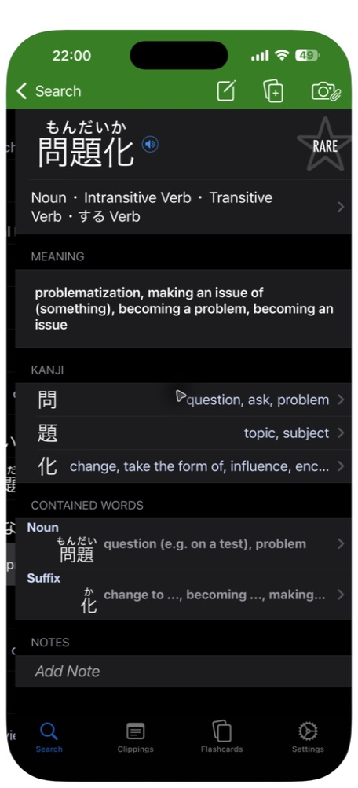</a> 
      <strong>Additional Match to Word Detail</strong> 
      <code>SEARCH-ACTION-007</code> with an Additional Match 
      Selecting 問題化 reaches its distinct Word Detail, proving that visible Additional Match rows are navigable.
    </td>
  </tr>
  <tr>
    <td width="50%" valign="top">
      <a id="capture-edge-results-to-kanji-detail-yabu" href="../../../../clone-discovery/nihongo/evidence/reference/screenshots/search-inventory/edge-results-to-kanji-detail-yabu.png">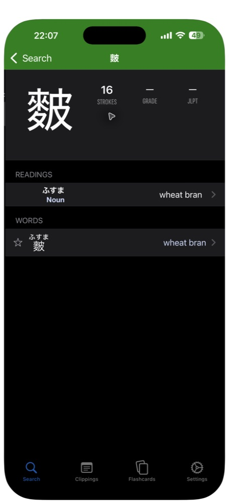</a> 
      <strong>KANJI primary row to Kanji Detail</strong> 
      <code>SEARCH-ACTION-009</code> → <code>LOOKUP-KANJI-DETAIL</code> 
      The 薮 KANJI row reaches a detail with glyph, stroke count, reading, and a related word row.
    </td>
    <td width="50%" valign="top">
      <a id="capture-edge-search-to-image-source-menu" href="../../../../clone-discovery/nihongo/evidence/reference/screenshots/search-inventory/edge-search-to-image-source-menu.png">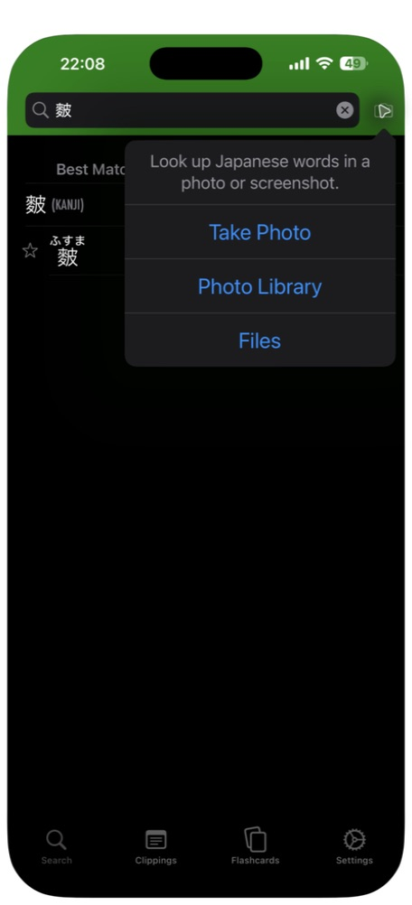</a> 
      <strong>Image-source menu</strong> 
      <code>SEARCH-ACTION-010</code> → <code>LOOKUP-IMAGE-SOURCE-MENU</code> 
      The menu states its purpose and offers Take Photo, Photo Library, and Files. Their protected destinations are assigned to the image-flow capture ticket.
    </td>
  </tr>
</table>

## Lifecycle restoration probe

<a id="capture-state-relaunch-restores-word-detail" href="../../../../clone-discovery/nihongo/evidence/reference/screenshots/search-inventory/state-relaunch-restores-word-detail.png">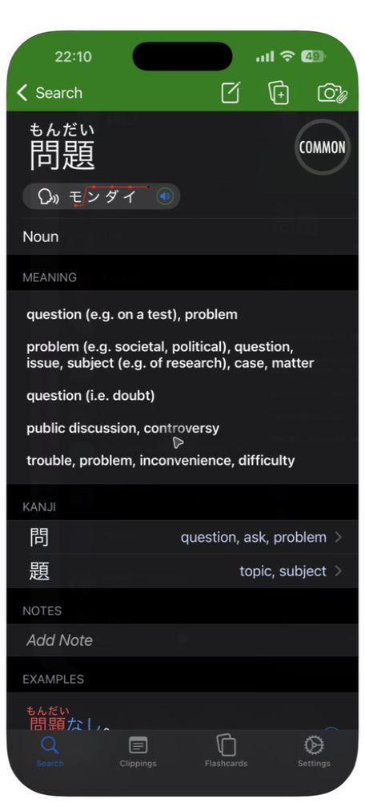</a>

**App-switcher/Spotlight restoration** — `SEARCH-ACTION-031`

After an app-switcher and Spotlight round trip, Nihongo returned to the same 問題 Word Detail. This establishes state restoration across that observed interruption only. It does not prove a cold process termination and relaunch; that remains `SEARCH-GAP-COLD-RELAUNCH` and `SEARCH-ACTION-032` is `unavailable_under_fixture`.

## Blocking gaps

This review must not be used to claim that Search discovery is complete. The canonical [coverage report](../../../../clone-discovery/nihongo/search-coverage-report.json) records these exact unresolved IDs:

| Gap | Missing evidence |
| --- | --- |
| `SEARCH-GAP-HISTORY-REMOVE` | Individual removal of one session-created history row |
| `SEARCH-GAP-SOFTWARE-KEYBOARD` | Standard iOS software-keyboard appearance, input-source behavior, and dismissal |
| `SEARCH-GAP-RESULT-SCROLL` | Terminal result extent, pagination/lazy loading, and scroll restoration |
| `SEARCH-GAP-OFFLINE-FAILURE-RETRY` | Offline, failure, retry, reconnect, and stale-result behavior |
| `SEARCH-GAP-HANDWRITING-ERASE` | Exact single-stroke erase/remove semantics |
| `SEARCH-GAP-HANDWRITING-LOW-CONFIDENCE` | Low-confidence and no-candidate handwriting behavior |
| `SEARCH-GAP-RADICAL-ZERO-AND-LARGE-SETS` | Zero-candidate and very-large candidate-set radical behavior |
| `SEARCH-GAP-COLD-RELAUNCH` | Process-proven cold termination and restoration |
| `SEARCH-GAP-LOADING` | A distinguishable loading presentation |

App-level semantic accessibility evidence is separately blocked by `ACCESS-BLOCKER-APP-SEMANTICS`. Camera, Photos, Files, permissions, and image-result behavior remain assigned to the image-flow capture ticket.

## Privacy and interpretation rules

- Every retained full-screen image contains only synthetic queries and public dictionary content.
- Input-panel crops exclude the history list.
- No pre-existing history, personal photo, file, clipboard payload, credential, or unrelated app thumbnail is retained.
- The images establish observed Nihongo behavior only. They do not authorize inferred behavior, internal implementation claims, or unapproved Zenbu deviations.
- Canonical mutable facts stay in the clone-discovery dossier; this README is a derived review index.
