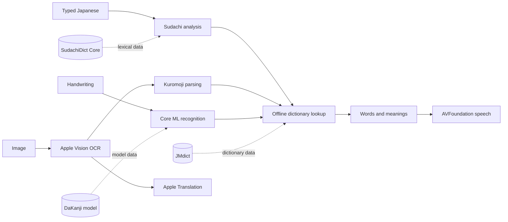

# Technologies

A technology performs work that directly enables a product capability, such as
recognizing text, analyzing Japanese, translating, speaking, or providing
offline reference data.

This catalog lists technologies used by implemented Zenbu Japanese products.
`Current consumer` records present use, not expected future reuse. Exact versions
belong in package manifests, lockfiles, and platform configuration. General
implementation plumbing and low-level framework details remain in the code.

## Capability flow

This simplified flow shows how representative technologies and data sources
support learner-facing capabilities. The catalogs remain the complete record.

| Capability | Technology | What it does | Current consumer | Canonical configuration or implementation |
| --- | --- | --- | --- | --- |
| Native app experience | SwiftUI | Presents and navigates the iOS app. | iOS | [`ZenbuJapaneseApp.swift`](../apps/ios/App/ZenbuJapaneseApp.swift) |
| Image Search | Apple Vision | Recognizes Japanese and English text and its position in selected images. | iOS | [`ImageTextRecognitionClient.swift`](../apps/ios/Modules/Sources/SearchExperience/ImageTextRecognitionClient.swift) |
| Handwriting Search | Core ML | Runs the DaKanji character-recognition model against a completed drawing. | iOS | [`OfflineHandwritingRecognizer.swift`](../apps/ios/Modules/Sources/SearchExperience/OfflineHandwritingRecognizer.swift) |
| Japanese text analysis | Sudachi.rs through sudachi-swift | Finds word boundaries, dictionary forms, readings, parts of speech, unknown-word status, and text ranges. | iOS | [`Package.swift`](../apps/ios/Modules/Package.swift), [`JapaneseMorphologyClient.swift`](../apps/ios/Modules/Sources/SearchExperience/JapaneseMorphologyClient.swift) |
| Interactive Japanese parsing | kuromoji.js through Apple JavaScriptCore | By default, finds word boundaries, dictionary forms, readings, parts of speech, unknown-word status, and text ranges for Image Search and linked Japanese text. A launch-environment switch retains Sudachi for local comparison. | iOS | [`Package.swift`](../apps/ios/Modules/Package.swift), [`SearchExperienceRootView.swift`](../apps/ios/Modules/Sources/SearchExperience/SearchExperienceRootView.swift), [`KuromojiMorphologyClient.swift`](../apps/ios/Modules/Sources/SearchExperience/KuromojiMorphologyClient.swift) |
| Japanese-to-English translation | Apple Translation | Translates recognized Japanese text using installed Apple language assets. | iOS | [`NaturalTranslationClient.swift`](../apps/ios/Modules/Sources/SearchExperience/NaturalTranslationClient.swift) |
| Japanese pronunciation | AVFoundation | Speaks Japanese words and example sentences with the system speech synthesizer. | iOS | [`SpeechSynthesisClient.swift`](../apps/ios/Modules/Sources/SearchExperience/SpeechSynthesisClient.swift) |
| Camera, photo, and file import | PhotosUI and UIKit | Accepts images for Image Search and saved word encounters. | iOS | [`SearchExperience`](../apps/ios/Modules/Sources/SearchExperience/) |
| Offline reference data | SQLite | Reads dictionary, example, stroke-diagram, and frequency databases on the device. | iOS | [`SearchExperience`](../apps/ios/Modules/Sources/SearchExperience/) |
| JPDB research warehouse | MySQL 8.x | Stores immutable owner-authorized structured frontend snapshots, response checksums/metadata, normalized facts, provenance, and validation evidence for internal analysis. HTML, CSS, and response bodies are not retained. It is not an app runtime dependency. | Internal iOS language-data tooling | [`jpdb_mysql`](../apps/ios/Tools/jpdb_mysql/) |
| Downloadable resource installation | CryptoKit and ZIPFoundation | Verifies and extracts downloadable frequency and language-analysis resources. | iOS | [`Package.swift`](../apps/ios/Modules/Package.swift), [`SearchExperience`](../apps/ios/Modules/Sources/SearchExperience/) |

Sudachi is analysis technology, not Zenbu's Japanese-English dictionary. Apple
Vision recognizes text but does not interpret its words. Apple Translation
produces natural translations but does not supply dictionary definitions. The
data each technology consumes is cataloged separately in
[`data-sources.md`](data-sources.md).
