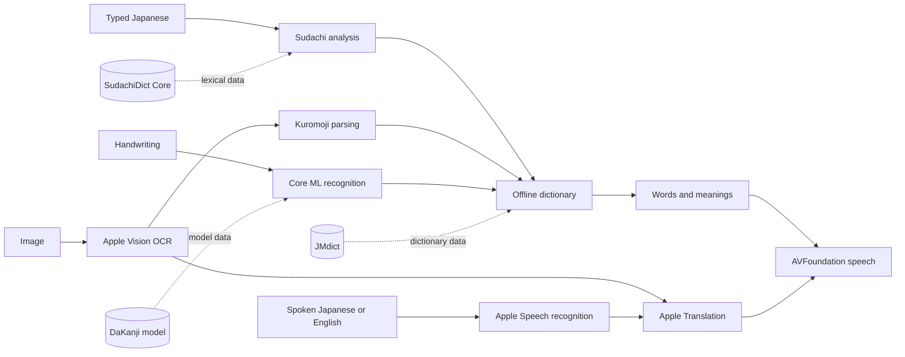

# Technologies

A technology performs work that directly enables a product capability, such as
recognizing text, analyzing Japanese, translating, speaking, or providing
offline reference data.

This catalog lists technologies used by implemented Zenbu Japanese products.
`Current consumer` records present use, not expected future reuse. Exact versions
belong in package manifests, lockfiles, and platform configuration. General
implementation plumbing and low-level framework details remain in the code.

## Capability flow

This simplified flow shows how representative technologies and data sources
support learner-facing capabilities. The catalogs remain the complete record.

```mermaid
flowchart LR
    Text["Typed Japanese"] --> Sudachi["Sudachi analysis"]
    Image["Image"] --> Vision["Apple Vision OCR"]
    Vision --> Kuromoji["Kuromoji parsing"]
    Drawing["Handwriting"] --> CoreML["Core ML recognition"]

    Sudachi --> Dictionary["Offline dictionary"]
    Kuromoji --> Dictionary
    CoreML --> Dictionary

    SudachiDict[("SudachiDict Core")] -. lexical data .-> Sudachi
    JMdict[("JMdict")] -. dictionary data .-> Dictionary
    DaKanji[("DaKanji model")] -. model data .-> CoreML

    Dictionary --> Results["Words and meanings"]
    Vision --> Translation["Apple Translation"]
    Results --> Speech["AVFoundation speech"]
    Voice["Spoken Japanese or English"] --> Recognition["Apple Speech recognition"]
    Recognition --> Translation
    Translation --> Speech
```

| Capability | Technology | What it does | Current consumer | Canonical configuration or implementation |
| --- | --- | --- | --- | --- |
| Native app experience | SwiftUI | Presents and navigates the app on iPhone, iPad, and the Mac, from one target; the few platform differences are adapters in `SearchExperience/Platform/` (ADR 0015). | iOS, iPadOS, macOS | [`ZenbuJapaneseApp.swift`](../apps/ios/App/ZenbuJapaneseApp.swift), [`AppScenes.swift`](../apps/ios/Modules/Sources/SearchExperience/Platform/AppScenes.swift) |
| Image Search | Apple Vision | Recognizes Japanese and English text and its position in selected images. | iOS | [`ImageTextRecognitionClient.swift`](../apps/ios/Modules/Sources/SearchExperience/ImageTextRecognitionClient.swift) |
| Handwriting Search | Core ML | Runs the DaKanji character-recognition model against a completed drawing. | iOS | [`OfflineHandwritingRecognizer.swift`](../apps/ios/Modules/Sources/SearchExperience/OfflineHandwritingRecognizer.swift) |
| Japanese text analysis | Sudachi.rs through sudachi-swift on iOS, and through @nikkei/napi-sudachi (the same sudachi.rs commit) in the website's dictionary service | Finds word boundaries, dictionary forms, readings, parts of speech, unknown-word status, and text ranges. On the website, it lists a sentence's Discovered Words. | iOS, website | [`Package.swift`](../apps/ios/Modules/Package.swift), [`JapaneseMorphologyClient.swift`](../apps/ios/Modules/Sources/SearchExperience/JapaneseMorphologyClient.swift), [`sudachi.ts`](../apps/dictionary-api/src/sudachi.ts) |
| Interactive Japanese parsing | kuromoji.js through Apple JavaScriptCore on iOS, and the same files in a Node V8 context in the website's dictionary service | By default, finds word boundaries, dictionary forms, readings, parts of speech, unknown-word status, and text ranges for Image Search and linked Japanese text. A launch-environment switch retains Sudachi for local comparison. On the website, it links example sentences' words and finds a conjugated form's examples. | iOS, website | [`Package.swift`](../apps/ios/Modules/Package.swift), [`SearchExperienceRootView.swift`](../apps/ios/Modules/Sources/SearchExperience/SearchExperienceRootView.swift), [`KuromojiMorphologyClient.swift`](../apps/ios/Modules/Sources/SearchExperience/KuromojiMorphologyClient.swift), [`kuromoji.ts`](../apps/dictionary-api/src/kuromoji.ts) |
| Video playback | WebKit with the YouTube IFrame Player API | Plays YouTube videos in the embedded player and reports playback time so captions follow along, and shows video search results in the app. | iOS | [`YouTubePlayer.swift`](../apps/ios/Modules/Sources/SearchExperience/YouTubePlayer.swift), [`VideoSearch.swift`](../apps/ios/Modules/Sources/SearchExperience/VideoSearch.swift) |
| Japanese-to-English translation | Apple Translation | Translates recognized Japanese text, and Player captions YouTube does not translate, using Apple language assets. | iOS | [`NaturalTranslationClient.swift`](../apps/ios/Modules/Sources/SearchExperience/NaturalTranslationClient.swift) |
| Live speech recognition | Apple Speech (SpeechAnalyzer and SpeechTranscriber) | Transcribes Japanese and English as they're spoken, one recognizer per language, using Apple language assets on the device. On a Mac, it transcribes recorded iPhone audio for the recorded-audio check. | iOS, Mac tool | [`BilingualRecognizer.swift`](../apps/ios/Modules/Sources/TranslatorOnDevice/BilingualRecognizer.swift), [`OnDeviceSpeechAssets.swift`](../apps/ios/Modules/Sources/TranslatorOnDevice/OnDeviceSpeechAssets.swift), [`Replay.swift`](../apps/ios/Tools/TranslateReplay/Sources/TranslateReplay/Replay.swift) |
| Conversation and typed translation | Apple Translation | Translates Translate's spoken sentences, typed text, and documents between Japanese and English, in either direction, and the recorded-audio check's sentences on a Mac. | iOS, Mac tool | [`OnDeviceSentenceTranslation.swift`](../apps/ios/Modules/Sources/TranslatorOnDevice/OnDeviceSentenceTranslation.swift), [`OnDeviceTranslation.swift`](../apps/ios/Modules/Sources/SearchExperience/Translate/OnDeviceTranslation.swift) |
| Echo-cancelled conversation audio | AVFoundation (AVAudioEngine voice processing and AVSpeechSynthesizer) | Captures the microphone with echo cancellation and plays spoken translations through the same engine, so the microphone doesn't transcribe them. | iOS | [`AnalyzerAudioPipeline.swift`](../apps/ios/Modules/Sources/SearchExperience/Translate/AnalyzerAudioPipeline.swift), [`EchoCancelledPlayback.swift`](../apps/ios/Modules/Sources/SearchExperience/Translate/EchoCancelledPlayback.swift) |
| Document text | PDFKit and Apple Vision | Reads a PDF's text, and recognizes the text of scanned pages, for Translate's Document. | iOS | [`DocumentText.swift`](../apps/ios/Modules/Sources/SearchExperience/Translate/DocumentText.swift) |
| Japanese pronunciation | AVFoundation | Speaks Japanese words and example sentences with the system speech synthesizer. | iOS | [`SpeechSynthesisClient.swift`](../apps/ios/Modules/Sources/SearchExperience/SpeechSynthesisClient.swift) |
| Camera and photo import | PhotosUI's picker, UIKit's camera picker, and on the Mac the pasteboard and Continuity Camera | Accepts images for Image Search and saved word encounters. | iOS, iPadOS, macOS | [`ImageTextImport.swift`](../apps/ios/Modules/Sources/SearchExperience/ImageTextImport.swift), [`CameraPicker.swift`](../apps/ios/Modules/Sources/SearchExperience/Platform/CameraPicker.swift), [`PhotoLibraryPicker.swift`](../apps/ios/Modules/Sources/SearchExperience/Platform/PhotoLibraryPicker.swift), [`DeviceImageImport.swift`](../apps/ios/Modules/Sources/SearchExperience/Platform/DeviceImageImport.swift) |
| Offline reference data | SQLite | Reads dictionary, example, stroke-diagram, and frequency databases on the device. | iOS | [`SearchExperience`](../apps/ios/Modules/Sources/SearchExperience/) |
| Downloadable resource installation | CryptoKit and ZIPFoundation | Verifies and extracts downloadable frequency and language-analysis resources. | iOS | [`Package.swift`](../apps/ios/Modules/Package.swift), [`SearchExperience`](../apps/ios/Modules/Sources/SearchExperience/) |
| Ordered frequency-pack installation | Swift, ZIPFoundation, CryptoKit, JSON, and SQLite | Downloads checksum-pinned ordered JSON archives from Zenbu's CDN, validates their exact ZIP/row contract, maps forms (and, under mapping policy v2, readings) to Language Reference IDs on-device, and installs removable SQLite packs. | iOS | [`FrequencyPackInstaller.swift`](../apps/ios/Modules/Sources/SearchExperience/FrequencyPackInstaller.swift), [`FrequencyPackCatalog.json`](../apps/ios/Modules/Sources/SearchExperience/Resources/FrequencyPackCatalog.json) |
| Frequency source analysis | Python, ZIP, JSON, and SQLite | Reproducibly maps candidate lists against Language Reference IDs, computes runtime trust hashes, and compares their ordering with current packs, TUBELEX, and Wikipedia. | iOS development | [`analyze_frequency_candidates.py`](../apps/ios/Tools/analyze_frequency_candidates.py), [`analyze_ordered_json_frequency_lists.py`](../apps/ios/Tools/analyze_ordered_json_frequency_lists.py), [`FREQUENCY_SOURCE_DECISIONS.md`](../apps/ios/LanguageData/FREQUENCY_SOURCE_DECISIONS.md) |
| Jiten frequency-pack builder | Python, ZIP, JSON, and SQLite | Builds the downloadable Jiten pack sources from pinned snapshots and writes their catalog manifests. | iOS development | [`build_jiten_frequency_packs.py`](../apps/ios/Tools/build_jiten_frequency_packs.py) |
| Downloadable file hosting | Cloudflare R2 (`zenbujapanese-cdn` bucket, SERP account) at `cdn.zenbujapanese.com` | Serves byte-identical, content-addressed copies of optional frequency-pack sources so downloads do not depend on third-party hosts. | iOS | [`publish_frequency_pack_sources.py`](../apps/ios/Tools/publish_frequency_pack_sources.py), [`FrequencyPackCatalog.json`](../apps/ios/Modules/Sources/SearchExperience/Resources/FrequencyPackCatalog.json) |
| Language-data release hosting | Cloudflare R2 (`zenbujapanese-language-data` bucket, SERP account), written through its S3 API by the AWS CLI | Holds every published language-data release: content-addressed files, one manifest per release, and the `releases.json` index. Nothing published is overwritten. Only the `Language data release` workflow writes to it. | None yet (step 4 of issue 463 planned the website's D1 import to read it; ADR 0009's dictionary service replaced that import) | [`publish.py`](../language-data/pipeline/publish.py), which writes through [`object_store.py`](../language-data/pipeline/object_store.py); [`language-data-release.yml`](../.github/workflows/language-data-release.yml) |
| Bundled frequency and level packs | Python and SQLite | Builds the bundled TUBELEX rank pack and JLPT level pack from pinned sources, with the hashes the app verifies before use. | iOS development | [`import_frequency_pack.py`](../apps/ios/Tools/import_frequency_pack.py), [`import_jlpt_level_pack.py`](../apps/ios/Tools/import_jlpt_level_pack.py) |
| Website | Next.js and React | Renders zenbujapanese.com pages, metadata, and sitemaps. | Website | [`apps/web/src/app`](../apps/web/src/app) |
| Website hosting | Cloudflare Workers through OpenNext | Serves the website from staging and production Workers. | Website | [`wrangler.jsonc`](../apps/web/wrangler.jsonc), [`open-next.config.ts`](../apps/web/open-next.config.ts) |
| Shared dictionary core | TypeScript | Ports the app's search, results, word and kanji detail, and example logic, and reads the app's language data with the app's own queries. | Website | [`packages/dictionary-core`](../packages/dictionary-core) |
| Website dictionary service | Node.js, Hono, and SQLite (`node:sqlite`), shipped as a Docker image; `jose` for account tokens; `@hono/zod-openapi` and Zod, dev dependencies, for the app routes' OpenAPI contract | Answers the website's search, word, kanji, example, and sitemap requests by running the shared core on the app's bundled language data, in worker threads behind a bearer token. Its routes for apps (`/v1/apps`) answer word cards and segmentation to an account's access token, checked against the account service's JWKS (ADR 0014); their contract is [`openapi.json`](../apps/dictionary-api/openapi.json). | Website; signed-in apps such as Tomodachi (#571) | [`apps/dictionary-api`](../apps/dictionary-api), [`Dockerfile`](../apps/dictionary-api/Dockerfile) |
| Dictionary service images | GitHub Container Registry (private `ghcr.io/serpcompany/zenbujapanese-dictionary-api`) | Holds each built image of the dictionary service, tagged by commit; the `staging` and `production` tags name what each environment runs. | Website | [`dictionary-api-deploy.yml`](../.github/workflows/dictionary-api-deploy.yml) |
| Dictionary service hosting | Docker on serpcompany's server, on an internal network shared only with its nginx, deployed by a root cron job there | Runs each environment's dictionary service in two slots under one network alias, reaching nothing but nginx. Every 5 minutes the deployer deploys the image each environment's tag names, swapping it in without downtime or an nginx reload, and keeps the old one when the new one doesn't start. GitHub has no access to the server. | Website | [`deployer.sh`](../deploy/deployer.sh), [`api-servers.md`](agents/api-servers.md) |
| Account service | Node.js and Hono, with `@hono/zod-openapi` and Zod declaring its routes, shipped as a Docker image | Holds Zenbu accounts, signs learners in, and keeps each learner's profile in step across their apps through a sync journal (ADR 0013). Its contract is [`openapi.json`](../apps/account-api/openapi.json). | The website's account pages (#468) and the iOS app (#573) | [`apps/account-api`](../apps/account-api), [`Dockerfile`](../apps/account-api/Dockerfile) |
| Sign-in | Better Auth, with Sign in with Apple, Google, and email codes; EdDSA access tokens and a JWKS | Signs learners in on the account service, keeps their sessions, and issues the 15-minute access tokens other services check. | The website's account pages (#468) and the iOS app (#573) | [`apps/account-api/src/auth`](../apps/account-api/src/auth) |
| Sign-in email | useSend's hosted API, from `support@zenbujapanese.com`, as serplists.com sends; Cloudflare Email Service's REST API also works, unused | Sends the sign-in codes and account notices, as SERP's transactional email standard says. | The website's account pages (#468) and the iOS app (#573) | [`mailer.ts`](../apps/account-api/src/email/mailer.ts) |
| Account database | PostgreSQL 18, through Drizzle ORM and `pg`, with versioned SQL migrations the service applies when it starts | Keeps each environment's accounts on serpcompany's server, in a container on an internal network only the account service's slots reach. Tests run it in-process with PGlite. | The website's account pages (#468) and the iOS app (#573) | [`apps/account-api/src/db`](../apps/account-api/src/db), [`migrations`](../apps/account-api/migrations) |
| Account service hosting and images | Docker on serpcompany's server, deployed by the same root cron job as the dictionary service; GitHub Container Registry (private `ghcr.io/serpcompany/zenbujapanese-account-api`) | Runs each environment's account service in two slots, as the dictionary service runs, at the API host it shares with the dictionary service by path (`api.zenbujapanese.com`). Its slots also reach the database's network and the internet, for Apple's and Google's keys and useSend. | The website's account pages (#468) and the iOS app (#573) | [`account-api-deploy.yml`](../.github/workflows/account-api-deploy.yml), [`api-servers.md`](agents/api-servers.md) |
| Account backups | `pg_dump` to a private Cloudflare R2 bucket (`zenbujapanese-account-backups`) through the AWS CLI, from a root cron job | Keeps 30 days of nightly backups of each environment's database, off the server, and restores one into a new database. | None yet | [`backups.sh`](../apps/account-api/deploy/backups.sh) |
| Website interface | Tailwind CSS and shadcn/ui | Styles website pages and provides UI components. | Website | [`components.json`](../apps/web/components.json), [`globals.css`](../apps/web/src/app/globals.css) |
| Website analytics | Cloudflare Web Analytics and Google Tag Manager | Counts website visits in production builds when their IDs are configured. | Website | [`analytics.tsx`](../apps/web/src/components/analytics.tsx) |

Sudachi is analysis technology, not Zenbu's Japanese-English dictionary. Apple
Vision recognizes text but does not interpret its words. Apple Translation
produces natural translations but does not supply dictionary definitions. The
data each technology consumes is cataloged separately in
[`data-sources.md`](data-sources.md).
